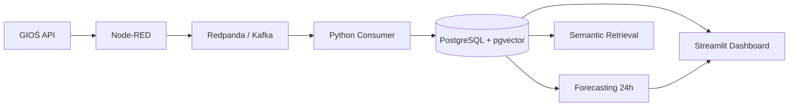

# Air Quality Gdańsk

System do zbierania, przetwarzania, przechowywania i prognozowania danych o jakości powietrza w Gdańsku.

Projekt korzysta z rzeczywistych danych GIOŚ dla PM2.5 i PM10, przesyła je przez Node-RED i Redpanda/Kafka, zapisuje w PostgreSQL + pgvector, generuje prognozę na 24h i prezentuje wyniki w dashboardzie Streamlit.

## Architektura



Przepływ danych:

```text
GIOŚ API
→ Node-RED
→ Redpanda / Kafka
→ Python Consumer
→ PostgreSQL + pgvector
→ Forecasting / Dashboard / RAG
```

## Technologie

- Docker Compose
- Node-RED
- Redpanda / Kafka API
- Python 3.12
- PostgreSQL 16
- pgvector
- pandas
- statsmodels
- Streamlit
- sentence-transformers

## Stacje

Projekt wykorzystuje 3 stacje GIOŚ:

| Stacja | PM10 | PM2.5 |
|---|---:|---:|
| PmGdaWyzwole | 4706 | 27667 |
| PmGdaPowWars | 4681 | 28227 |
| PmGdaGrunwal | 26171 | 26172 |

## Kafka

Topic:

```text
air-quality.raw
```

Przykładowa wiadomość:

```json
{
  "station_code": "PmGdaWyzwole",
  "measured_at": "2026-09-25 16:00:00",
  "pm25": 4.7,
  "pm10": 6.8,
  "source": "GIOS"
}
```

## Baza danych

Główne tabele:

```text
measurements
forecasts
knowledge_base
```

`measurements` przechowuje pomiary, `forecasts` prognozy 24h, a `knowledge_base` dane wektorowe do wyszukiwania semantycznego.

Duplikaty pomiarów są blokowane dla:

```text
station_code + measured_at
```

## Forecasting

Moduł `forecasting/forecast.py` generuje prognozę PM2.5 i PM10 na 24 godziny dla każdej stacji.

Używany model:

```text
Holt-Winters Exponential Smoothing
```

Brakujące godziny są uzupełniane interpolacją liniową.

Prognoza uruchamia się automatycznie co godzinę.

## Dashboard

Dashboard Streamlit:

```text
http://localhost:8501
```

Pokazuje:

- wybór stacji,
- ostatni pomiar PM2.5 i PM10,
- historię pomiarów,
- prognozę 24h,
- tabelę prognoz.

## pgvector / RAG

Baza wykorzystuje rozszerzenie:

```sql
CREATE EXTENSION IF NOT EXISTS vector;
```

Tabela `knowledge_base` zawiera:

```text
embedding vector(384)
```

Embeddingi generowane są lokalnie przez:

```text
sentence-transformers/all-MiniLM-L6-v2
```

Przykładowe uruchomienie:

```bash
docker compose run --rm rag
```

Aktualna wersja realizuje semantic retrieval z wykorzystaniem pgvector.

## Uruchomienie

```bash
git clone <adres-repozytorium>
cd air-quality-gdansk
docker compose up -d --build
```

Sprawdzenie:

```bash
docker compose ps
```

Dostępne usługi:

| Usługa | Adres |
|---|---|
| Dashboard | http://localhost:8501 |
| Node-RED | http://localhost:1880 |
| Redpanda Console | http://localhost:8080 |
| PostgreSQL | localhost:5432 |
| Kafka | localhost:19092 |

## Struktura

```text
air-quality-gdansk/
├── consumer/
├── database/
├── forecasting/
├── dashboard/
├── rag/
├── nodered/
├── docker-compose.yml
└── README.md
```

## Status

Działające elementy:

- dane z API GIOŚ,
- Node-RED,
- Kafka / Redpanda,
- Python consumer,
- PostgreSQL + pgvector,
- import historii,
- 3 stacje Gdańska,
- prognoza 24h,
- automatyczne odświeżanie forecastingu,
- dashboard,
- semantic retrieval.

## Ograniczenia

Projekt jest wersją MVP.

Najważniejsze ograniczenia:

- niewielki zbiór danych historycznych,
- prosty model forecastingu,
- brak danych meteorologicznych,
- RAG działa obecnie jako retrieval bez generatywnego LLM.

## Możliwe rozszerzenia

- większy zakres historii,
- dane pogodowe,
- bardziej zaawansowany model ML,
- MAE / RMSE,
- wielojęzyczny model embeddingowy,
- pełny RAG z lokalnym LLM,
- mapa stacji.