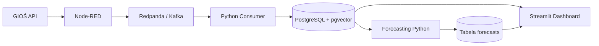

# Air Quality Gdańsk

System do zbierania, przetwarzania, przechowywania i prognozowania jakości powietrza w Gdańsku.

Projekt wykorzystuje dane pomiarowe GIOŚ dotyczące pyłów zawieszonych **PM2.5** oraz **PM10**. Dane są pobierane przez Node-RED, przesyłane przez broker Kafka-compatible Redpanda, zapisywane w PostgreSQL oraz wykorzystywane do generowania prognozy jakości powietrza na kolejne 24 godziny.

System jest uruchamiany w kontenerach Docker.

---

## Architektura



Przepływ danych:

1. **GIOŚ API** udostępnia bieżące pomiary jakości powietrza.
2. **Node-RED** pobiera dane PM2.5 i PM10.
3. Dane są składane do jednego komunikatu JSON.
4. Komunikat trafia do topicu `air-quality.raw` w **Redpanda**.
5. **Python Consumer** odczytuje wiadomości z brokera.
6. Dane są zapisywane do **PostgreSQL**.
7. Moduł **forecasting** pobiera historię pomiarów i generuje prognozę na 24 godziny.
8. Prognozy są zapisywane ponownie w PostgreSQL.
9. **Streamlit Dashboard** prezentuje historię pomiarów oraz prognozy.

---

## Technologie

- Docker / Docker Compose
- Node-RED
- Redpanda
- Apache Kafka API
- Python 3.12
- PostgreSQL 16
- pgvector
- pandas
- statsmodels
- psycopg2
- Streamlit
- REST API GIOŚ

---

## Stacje pomiarowe

Projekt wykorzystuje trzy stacje GIOŚ z różnych części Gdańska.

### PmGdaWyzwole

- PM10 sensor ID: `4706`
- PM2.5 sensor ID: `27667`

### PmGdaPowWars

- PM10 sensor ID: `4681`
- PM2.5 sensor ID: `28227`

### PmGdaGrunwal

- PM10 sensor ID: `26171`
- PM2.5 sensor ID: `26172`

---

## Topic Kafka

Dane pomiarowe są publikowane do:

```text
air-quality.raw
```

Przykładowa wiadomość:

```json
{
  "station_code": "PmGdaWyzwole",
  "measured_at": "2026-09-25 16:00:00",
  "pm25": 4.7,
  "pm10": 6.8,
  "temperature": null,
  "humidity": null,
  "pressure": null,
  "source": "GIOS"
}
```

---

## Baza danych

Główna tabela:

```text
measurements
```

Przechowuje m.in.:

- identyfikator stacji,
- czas pomiaru,
- PM2.5,
- PM10,
- temperaturę,
- wilgotność,
- ciśnienie,
- źródło danych.

Duplikaty są blokowane dla kombinacji:

```text
station_code + measured_at
```

Dzięki temu ponowne pobranie tego samego pomiaru nie tworzy kolejnego rekordu.

Prognozy zapisywane są w tabeli:

```text
forecasts
```

Każda stacja posiada prognozę PM2.5 oraz PM10 na kolejne 24 godziny.

---

## Import historii

Skrypt:

```text
consumer/history_import.py
```

pobiera dostępne dane historyczne PM2.5 i PM10 z API GIOŚ dla skonfigurowanych stacji.

Uruchomienie:

```bash
docker compose run --rm consumer python history_import.py
```

---

## Forecasting

Moduł:

```text
forecasting/forecast.py
```

pobiera dane historyczne z PostgreSQL dla każdej stacji.

Przed trenowaniem:

- usuwa duplikaty czasowe,
- tworzy regularny szereg godzinowy,
- uzupełnia brakujące godziny interpolacją liniową.

Do prognozowania wykorzystywany jest model:

```text
Holt-Winters Exponential Smoothing
```

Prognozowane są osobno:

- PM2.5,
- PM10.

Horyzont prognozy:

```text
24 godziny
```

Forecasting uruchamia się automatycznie co godzinę w kontenerze Docker.

---

## Dashboard

Dashboard został wykonany w Streamlit.

Pozwala na:

- wybór stacji,
- podgląd ostatniego pomiaru PM2.5,
- podgląd ostatniego pomiaru PM10,
- podgląd historii pomiarów,
- wykres prognozy na 24 godziny,
- tabelę wartości prognozowanych.

Adres:

```text
http://localhost:8501
```

---

## Node-RED

Node-RED odpowiada za warstwę integracyjną / IoT.

Adres:

```text
http://localhost:1880
```

Flow Node-RED został również wyeksportowany do repozytorium:

```text
nodered/flows.json
```

Schemat przepływu:

```text
Inject
  |
  +----> GIOŚ PM2.5 --> JSON --> Extract PM2.5 --+
  |                                               |
  +----> GIOŚ PM10  --> JSON --> Extract PM10 ----+--> Join
                                                       |
                                                       v
                                                Build measurement
                                                       |
                                                       v
                                                Kafka Producer
```

---

## Redpanda Console

Panel do obserwowania wiadomości Kafka:

```text
http://localhost:8080
```

Pozwala m.in. podejrzeć topic:

```text
air-quality.raw
```

oraz wiadomości generowane przez Node-RED.

---

## Uruchomienie projektu

Wymagany jest:

- Docker Desktop
- Docker Compose

Sklonuj repozytorium:

```bash
git clone <adres-repozytorium>
cd air-quality-gdansk
```

Uruchom cały system:

```bash
docker compose up -d --build
```

Sprawdź kontenery:

```bash
docker compose ps
```

Powinny działać m.in.:

```text
redpanda
redpanda-console
air-postgres
nodered
air-consumer
air-forecasting
air-dashboard
```

---

## Dostępne usługi

| Usługa | Adres |
|---|---|
| Dashboard | http://localhost:8501 |
| Node-RED | http://localhost:1880 |
| Redpanda Console | http://localhost:8080 |
| PostgreSQL | localhost:5432 |
| Redpanda Kafka | localhost:19092 |

---

## Struktura projektu

```text
air-quality-gdansk/
│
├── consumer/
│   ├── consumer.py
│   ├── history_import.py
│   ├── Dockerfile
│   └── requirements.txt
│
├── database/
│   └── init.sql
│
├── forecasting/
│   ├── forecast.py
│   ├── Dockerfile
│   └── requirements.txt
│
├── dashboard/
│   ├── app.py
│   ├── Dockerfile
│   └── requirements.txt
│
├── nodered/
│   └── flows.json
│
├── docker-compose.yml
└── README.md
```

---

## Status projektu

Aktualnie działają:

- pobieranie rzeczywistych danych z API GIOŚ,
- automatyczne pobieranie danych przez Node-RED,
- przesyłanie danych przez Kafka / Redpanda,
- Python Kafka Consumer,
- zapis pomiarów do PostgreSQL,
- ochrona przed duplikatami,
- import danych historycznych,
- obsługa trzech stacji Gdańska,
- prognoza PM2.5 i PM10 na 24 godziny,
- automatyczne odświeżanie prognozy,
- zapis prognoz w PostgreSQL,
- dashboard Streamlit,
- pełna konteneryzacja Docker Compose.

---

## Dalszy rozwój

Możliwe rozszerzenia:

- pobieranie większego zbioru danych historycznych,
- wykorzystanie danych meteorologicznych,
- bardziej zaawansowane modele ML,
- porównanie kilku modeli prognozowania,
- walidacja jakości prognozy MAE / RMSE,
- wykorzystanie rozszerzenia pgvector,
- utworzenie warstwy RAG/LLM do tekstowego opisywania wyników,
- dodanie mapy stacji,
- obsługa kolejnych stacji pomiarowych.

---

## Uwagi

Obraz PostgreSQL używany przez projekt posiada rozszerzenie **pgvector**, dzięki czemu architektura może zostać rozszerzona o dane wektorowe oraz system RAG.

Aktualny moduł prognozowania korzysta przede wszystkim z relacyjnych danych pomiarowych. pgvector nie jest jeszcze wykorzystywany przez podstawowy model forecastingowy.

Model prognozowania w aktualnej wersji jest modelem demonstracyjnym. Przy większej liczbie danych historycznych możliwe jest zastosowanie bardziej zaawansowanych metod i dokładniejsza ocena jakości prognoz.